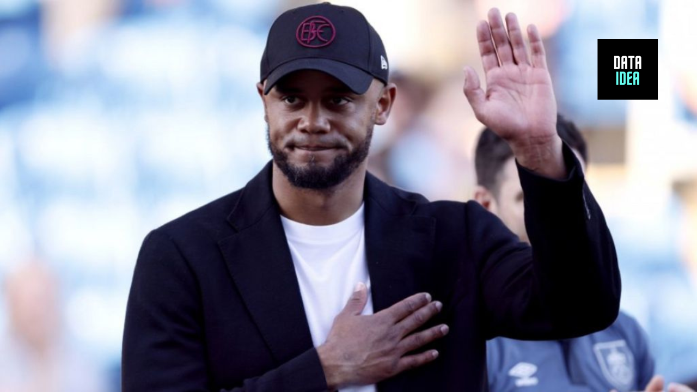

After a difficult Bundesliga season, Bayern Munich looks likely to hire Burnley head coach Vincent Kompany as their new head coach.

Kompany, who won the Premier League four times as a player with Manchester City and learned German during his time as a player with Hamburger SV, is seen as one of the top up-and-coming head coaches.

He started his coaching career at Belgian side Anderlecht, where he led them to a cup final in 2022, before moving to English side Burnley. At Burnley, he won promotion back to the Premier League in 2022/23, amassing more than 100 points in the EFL Championship while playing a style of soccer very different from Burnley’s more direct approach under previous boss Sean Dyche.

<ins class="adsbygoogle"
     style="display:block; text-align:center;"
     data-ad-layout="in-article"
     data-ad-format="fluid"
     data-ad-client="ca-pub-8076040302380238"
     data-ad-slot="8693891310"></ins>

But this season, despite spending more on transfers than other teams in the lower part of the Premier League, and despite two of their relegation rivals getting given points deductions, Burnley was relegated this season after finishing 19th in the league table.

Burnley won just five league games all season, two of which came against bottom-of-the-league Sheffield United, and only scored 41 goals, the second fewest in the league.

<ins class="adsbygoogle"
     style="display:block; text-align:center;"
     data-ad-layout="in-article"
     data-ad-format="fluid"
     data-ad-client="ca-pub-8076040302380238"
     data-ad-slot="8693891310"></ins>

**So why are Bayern Munich interested in Kompany?**

Part of the reason is that so many top clubs are looking for new head coaches and there aren’t that many options available. In an ideal world, Bayern might have wanted the likes of Xabi Alonso, who led Bayer Leverkusen to an undefeated Bundesliga season, or Arne Slot, who has just joined Liverpool. The Bavarian club were also reportedly turned down by Julian Nagelsmann and Ralf Rangnick.

Another reason is that there are some caveats to Burnley’s relegation. The gulf between the Championship and the Premier League is huge, and newly promoted sides need to spend big to have any chance of survival. Burnley’s spending seems even higher because the Clarets mainly targeted up-and-coming young talents like goalkeeper James Trafford, paying a premium for their potential to be stars several years down the line and for their high resale value.

<ins class="adsbygoogle"
     style="display:block; text-align:center;"
     data-ad-layout="in-article"
     data-ad-format="fluid"
     data-ad-client="ca-pub-8076040302380238"
     data-ad-slot="8693891310"></ins>

The main reason Kompany is in the running for German soccer’s biggest job, though, is the style of play he looked to introduce at Burnley.

Kompany tried to get Burnley to build from the back and play a possession-based style of soccer, with the 12th most possession, 12th most passes with an average of 432 per game, and 12th best passing accuracy in the Premier League, while making very few crosses or counter-attacks. They were basically the second-best team in the bottom half when it comes to passing the ball around the pitch. This playing style starts with Burnley’s goalkeepers, James Trafford and Arijanet Muric, whose 1826 combined passes were more than the goalkeepers of any other Premier League team.

The statistics show that Kompany got Burnley playing an easy-on-the-eye style of soccer, but it lacked a cutting edge, with the Lancashire side unable to create chances in the penalty area, and subsequently having the worst expected goals per shot in the league.

<ins class="adsbygoogle"
     style="display:block; text-align:center;"
     data-ad-layout="in-article"
     data-ad-format="fluid"
     data-ad-client="ca-pub-8076040302380238"
     data-ad-slot="8693891310"></ins>

Relegation shouldn’t necessarily be a blot on a head coach’s career. Even Jurgen Klopp, while at Mainz, got relegated. But some Burnley fans must be wondering whether a more pragmatic approach might have given them a better chance of Premier League survival.

In the 2022/23 season, Steve Cooper tried playing a more expansive style of soccer with Nottingham Forest, but after a 4-0 loss to Leicester City, he changed to a more defense-first approach that in the end kept Forest in the Premier League.

Sean Dyche this season at Everton has played a style of soccer that some fans see as unwatchable, but it has kept Everton comfortably in the Premier League despite an eight-point deduction, and the Toffees would have finished even higher up the table had Dominic Calvert-Lewin been able to finish. Only Liverpool’s Darwin Nunez had a bigger deficit between expected goals and actual goals scored than the Everton striker. Dyche said after beating Liverpool 2-0 that he wanted “to play beautiful football if I can, but I want to play winning football first.”

<ins class="adsbygoogle"
     style="display:block; text-align:center;"
     data-ad-layout="in-article"
     data-ad-format="fluid"
     data-ad-client="ca-pub-8076040302380238"
     data-ad-slot="8693891310"></ins>

And in recent seasons, David Moyes’ supposedly ugly soccer took West Ham United to a European trophy and their most successful spell in the Premier League in a long time.

Head coaches looking at the contrasting fates of Vincent Kompany, who is on the brink of one of the biggest jobs in soccer, and David Moyes, who left West Ham United this month, must be wondering whether beautiful soccer trumps winning soccer.

Moyes and Dyche might be winning ugly, but Kompany’s beautiful defeats look to be better for his career.

<h2>You may like:</h2>
<a href="/posts/best_signings_23_24/">
<h4>Best Signings of 23/24 Season</h4>

</a>

